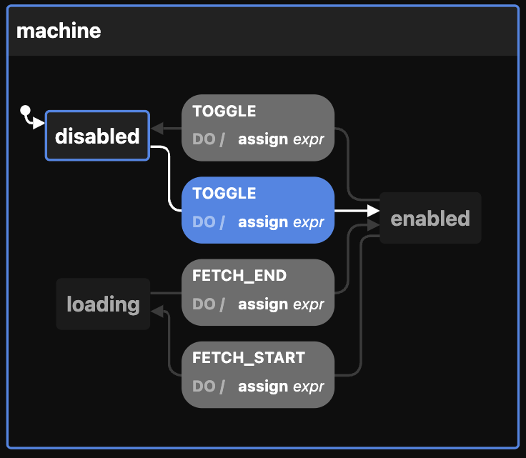

# xstate-demo

Just a simply (pure TypeScript and HTML) of the [x-state](https://xstate.js.org/) machine usage.
Fell free to use  [X-state visualiser](https://stately.ai/viz) to display `machine` definition from [index.tsx](src/index.ts) file, to see it in action

P.S. This repo is the second part of the state management story (Frontend sync). First part available here: https://github.com/Bigismall/frontend-sync-state-reducers



## Building and running on localhost

First install dependencies:

```sh
npm install
```

To run in hot module reloading mode:

```sh
npm start
```

To create a production build:

```sh
npm run build-prod
```

## Running

```sh
node dist/bundle.js
```

## Credits

Made with [createapp.dev](https://createapp.dev/)

